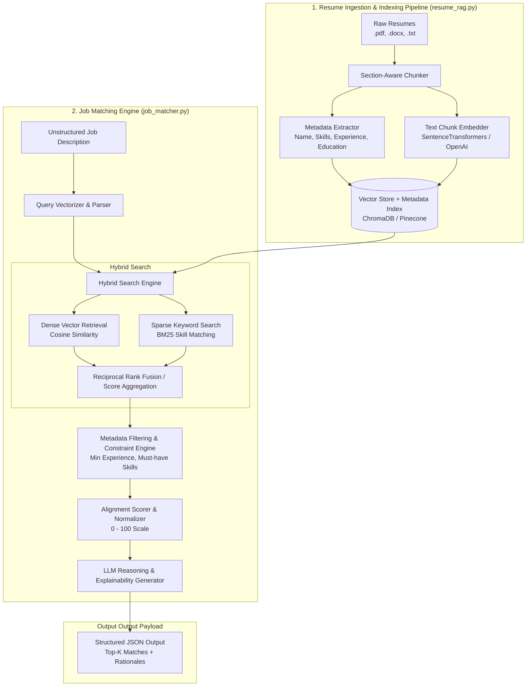
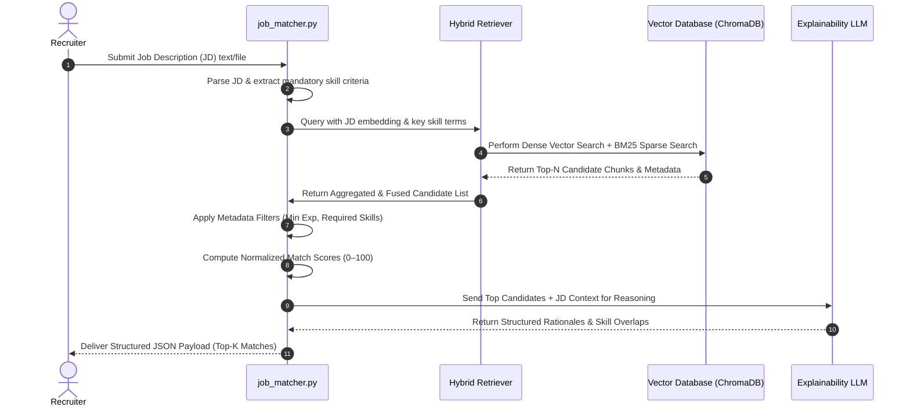

# System Architecture: Intelligent Resume-to-Job Matching Engine (RAG)

## 1. System Overview

The **Resume-to-Job Matching Engine** is a Retrieval-Augmented Generation (RAG) system engineered to overcome the limitations of traditional keyword-based Applicant Tracking Systems (ATS). By combining **section-aware semantic chunking**, **structured metadata extraction**, **dense-sparse hybrid retrieval**, and **LLM-driven explainability**, the system evaluates candidate fit against job requirements with high accuracy and transparency.

---

## 2. High-Level Architecture Diagram



---

## 3. Core Subsystems & Components

### 3.1 Document Ingestion & Section Parsing Module (`resume_rag.py`)
* **Multi-Format Ingestion:** Supports `.pdf` (PyMuPDF / pdfplumber), `.docx` (python-docx), and `.txt` files.
* **Section-Aware Chunking:** Uses layout and heading detection to partition resumes into logical sections (`Summary`, `Work Experience`, `Education`, `Skills`, `Certifications`) rather than fixed-character windows. This guarantees semantic context preservation.

### 3.2 Metadata Extraction Module
* **Entity Extraction:** Extracts key contextual attributes during ingestion:
  * `candidate_name`: Identified from header/top sections.
  * `skills`: Normalized set of technical and soft skills.
  * `experience_years`: Total professional experience calculated from employment dates.
  * `education`: Highest degree attained and domain of study.
* **Metadata Attachment:** Attaches extracted entities as JSON metadata payload to each chunk stored in the vector database.

### 3.3 Vector Store & Indexing Layer
* **Embedding Model:** Dense vector embedding generation using `all-MiniLM-L6-v2` / `text-embedding-3-small` or Hugging Face embeddings.
* **Vector Store:** ChromaDB (local persistent storage) indexing vector embeddings along with metadata filters for fast similarity retrieval.

### 3.4 Hybrid Retrieval Engine (`job_matcher.py`)
* **Dense Semantic Search:** Calculates cosine similarity between vector-embedded Job Description and resume section chunks.
* **Sparse Keyword Search (BM25):** Performs exact keyword matching over mandatory hard skills and toolsets to mitigate semantic embedding hallucinations.
* **Score Fusion:** Combines dense ($\mathbf{S}_{\text{dense}}$) and sparse ($\mathbf{S}_{\text{sparse}}$) similarity scores using weighted fusion:
  $$\mathbf{S}_{\text{hybrid}} = \alpha \cdot \mathbf{S}_{\text{dense}} + (1 - \alpha) \cdot \mathbf{S}_{\text{sparse}} \quad (\alpha \approx 0.7)$$

### 3.5 Ranking, Filtering & Explainability Engine
* **Constraint Filtering:** Filters candidate matches based on pre/post-retrieval rules (e.g., minimum experience threshold, mandatory programming languages).
* **Score Normalization:** Maps composite similarity scores onto a standard `0–100` alignment scale.
* **Explainable AI (XAI) Generator:** Generates natural language reasoning citing exact matched skills, key experience highlights, and gap analysis for recruiters.

---

## 4. Sequence & Data Flow Diagram



---

## 5. Data Schemas & Contracts

### 5.1 Vector Store Chunk Metadata Schema
```json
{
  "resume_id": "jane_doe_2026",
  "candidate_name": "Jane Doe",
  "resume_path": "data/resumes/jane_doe.pdf",
  "section_type": "Work Experience",
  "skills": ["Python", "PyTorch", "RAG", "Kubernetes"],
  "total_experience_years": 5.5,
  "degree": "Master of Science in Computer Science"
}
```

### 5.2 System Output JSON Schema
```json
{
  "job_description_summary": "Senior ML Engineer specializing in LLMs...",
  "total_candidates_evaluated": 30,
  "top_matches": [
    {
      "candidate_name": "Jane Doe",
      "resume_path": "resumes/jane_doe.pdf",
      "match_score": 92,
      "matched_skills": ["Python", "PyTorch", "Retrieval-Augmented Generation", "Transformers"],
      "relevant_excerpts": [
        "Led deployment of enterprise RAG pipelines reducing query latency by 40%...",
        "5+ years scaling distributed training workloads on Kubernetes."
      ],
      "reasoning": "Strong match: exceeds 5+ years requirement in Python and distributed ML frameworks; exhibits direct production experience with RAG architectures."
    }
  ]
}
```

---

## 6. Technology Stack & Component Justifications

| Layer | Component / Tool | Rationale |
| :--- | :--- | :--- |
| **Language** | Python 3.10+ | Standard ecosystem for ML, NLP, and RAG architectures. |
| **Parsing** | PyMuPDF, python-docx, pdfplumber | Reliable text and layout extraction across PDF and Word formats. |
| **Embeddings** | Hugging Face (`all-MiniLM-L6-v2`) / OpenAI Embeddings | High semantic fidelity with minimal embedding latency. |
| **Vector Database** | ChromaDB | Lightweight, open-source local vector store with native metadata filtering. |
| **Sparse Retrieval** | `rank_bm25` | Ensures exact keyword matching for technical skill validation. |
| **LLM Reasoning** | LangChain / LlamaIndex / OpenAI API | Robust orchestration for prompt chaining and structured JSON output. |
| **Evaluation** | Jupyter Notebook, pandas, scikit-learn | Quantitative benchmarking of retrieval accuracy and latency metrics. |
