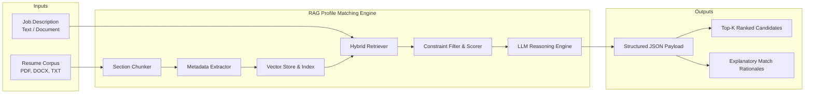

# Domain & System Context: Intelligent Resume-to-Job Matching Engine (RAG)

## 1. Executive Context & Industry Problem

Traditional Applicant Tracking Systems (ATS) rely primarily on deterministic, keyword-based search algorithms to filter job applications. While computationally efficient, keyword matching creates two critical industry challenges:

1. **High False Negative Rates:** Highly qualified candidates are rejected due to minor vocabulary discrepancies (e.g., a resume listing "Deep Learning & Transformer Architectures" missing the keyword "LLM Engineer").
2. **High False Positive Rates:** Underqualified candidates score high on ATS relevance by padding resumes with popular buzzwords without real-world project context or requisite depth of experience.
3. **Lack of Explainability:** HR teams receive arbitrary percentage scores without contextual justification, requiring manual review of hundreds of document pages.

The **Intelligent Resume-to-Job Matching Engine** solves this by applying **Retrieval-Augmented Generation (RAG)** combined with **hybrid dense-sparse search** and **structured metadata extraction**.

---

## 2. RAG Adaptation for Recruitment Domains

Standard RAG architectures designed for generic document Q&A (e.g., fixed 500-character chunking) fail when applied to resumes and job descriptions because:
* **Section Fragmentation:** Arbitrary character slicing splits work history across chunks, separating company context from accomplishments.
* **Temporal Context Loss:** A candidate's experience years and career progression are lost when individual sentences are embedded in isolation.
* **Hard vs. Soft Skill Duality:** Semantic embeddings capture concepts well but often overlook exact, non-negotiable tool version or certification requirements.

### System Solution Strategy
Our architecture addresses these domain challenges through:
- **Structural Chunking:** Ingesting resumes by logical sections (`Summary`, `Work Experience`, `Education`, `Skills`, `Certifications`).
- **Automated Metadata Tagging:** Extracting `candidate_name`, `skills`, `total_experience_years`, and `highest_degree` as persistent index metadata.
- **Hybrid Retrieval:** Blending dense semantic similarity (vector space) with sparse keyword validation (BM25 algorithm).
- **Actionable Explainability:** Using an LLM to generate evidence-backed matching rationales citing candidate excerpts.

---

## 3. Core System Boundaries & Scope

---

## 4. Key Stakeholders & Usage Personas

| Stakeholder Persona | Primary Need | System Touchpoint |
| :--- | :--- | :--- |
| **Technical Recruiter** | Rapidly filter 100+ applications down to top 10 candidates with clear justification. | Uses `job_matcher.py` CLI / JSON API payload to view candidate rankings and match rationales. |
| **Hiring Manager** | Verify candidate has exact technical depth and required experience years for senior roles. | Reviews output `relevant_excerpts` and `matched_skills` array in JSON output. |
| **System Administrator** | Ingest new resume batches, update embedding indexes, and monitor latency. | Executes `resume_rag.py` pipeline and views `notebooks/evaluation.ipynb` metrics. |

---

## 5. Architectural Principles

1. **Reproducibility & Determinism:** Dense embeddings provide semantic depth while BM25 ensures exact keyword precision for mandatory skill sets.
2. **Explainability Over Black-Box Scoring:** Scores ($0–100$) are accompanied by human-readable explanations citing specific resume sections.
3. **Modularity & Flexibility:** Ingestion (`resume_rag.py`) and Retrieval/Matching (`job_matcher.py`) are decoupled, allowing standalone vector updates and real-time query matching.
