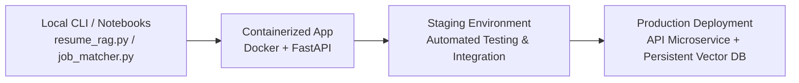

# Deployment Plan: Intelligent Resume-to-Job Matching Engine (RAG)

## 1. Deployment Overview & Environments

This deployment plan outlines the operational strategy for deploying the RAG Profile Matching Engine from local development/evaluation to containerized environments and staging/production REST API services.



---

## 2. Target Environments & Hardware Requirements

| Environment | Purpose | Target Hosting | Compute / Storage |
| :--- | :--- | :--- | :--- |
| **Development** | Script development, local indexing, evaluation notebook. | Local Workstation | 8-core CPU, 16GB RAM, Local ChromaDB SQLite. |
| **Staging** | Automated integration tests, batch resume ingestion. | Docker Container / AWS ECS | 4 vCPU, 8GB RAM, Shared Volume for ChromaDB. |
| **Production** | Live REST API matching queries against vector index. | Cloud Container (AWS ECS / GCP Cloud Run) | 4 vCPU, 16GB RAM, ChromaDB Server / Managed Vector Store. |

---

## 3. Containerization Strategy (`Dockerfile`)

A multi-stage `Dockerfile` ensures lightweight container footprint and isolation of Python dependencies.

```dockerfile
# Base Python Runtime
FROM python:3.10-slim AS base

WORKDIR /app

# Install System Dependencies for PDF & DOCX Parsing
RUN apt-get update && apt-get install -y --no-install-recommends \
    build-essential \
    poppler-utils \
    tesseract-ocr \
    && rm -rf /var/lib/apt/lists/*

# Install Python Dependencies
COPY requirements.txt .
RUN pip install --no-cache-dir -r requirements.txt

# Copy Application Source Code
COPY src/ ./src/
COPY resume_rag.py .
COPY job_matcher.py .
COPY data/ ./data/

# Environment Variables
ENV PYTHONUNBUFFERED=1
ENV CHROMADB_PATH="/app/data/chroma_db"

EXPOSE 8000

# Default Command: Help or REST API server
CMD ["python", "job_matcher.py", "--help"]
```

---

## 4. API Wrapper Specification (FastAPI Integration)

To expose `job_matcher.py` functionality as a production microservice:

```python
# app.py (FastAPI Wrapper)
from fastapi import FastAPI, HTTPException, UploadFile, File
from pydantic import BaseModel
from typing import List, Optional
from job_matcher import JobMatcherEngine

app = FastAPI(title="Resume-to-Job Matching RAG API", version="1.0.0")
matcher = JobMatcherEngine()

class MatchRequest(BaseModel):
    job_description: str
    top_k: Optional[int] = 10
    min_experience_years: Optional[float] = None
    required_skills: Optional[List[str]] = None

@app.post("/api/v1/match", response_model=dict)
async def match_candidates(request: MatchRequest):
    try:
        results = matcher.run_match(
            jd_text=request.job_description,
            top_k=request.top_k,
            min_exp=request.min_experience_years,
            req_skills=request.required_skills
        )
        return results
    except Exception as e:
        raise HTTPException(status_code=500, detail=str(e))

@app.post("/api/v1/index-resumes")
async def index_resumes():
    # Trigger resume_rag.py pipeline asynchronously
    return {"status": "Ingestion job started"}
```

---

## 5. Persistence & Vector Database Strategy

* **Local Development & Testing:** ChromaDB in persistent directory mode (`./data/chroma_db`).
* **Production Deployment:** 
  - Option A: Embedded ChromaDB with volume mount (EFS / Cloud Storage).
  - Option B: Hosted / Managed Vector DB (Pinecone, Qdrant, or Chroma Cloud) for zero-downtime horizontal scaling.

---

## 6. CI/CD Pipeline Automation (GitHub Actions Workflow)

```yaml
name: CI/CD RAG Matching Pipeline

on:
  push:
    branches: [ main, develop ]
  pull_request:
    branches: [ main ]

jobs:
  test-and-validate:
    runs-on: ubuntu-latest
    steps:
      - uses: actions/checkout@v3

      - name: Set up Python 3.10
        uses: actions/setup-python@v4
        with:
          python-version: "3.10"

      - name: Install Dependencies
        run: |
          python -m pip install --upgrade pip
          pip install -r requirements.txt
          pip install pytest pydantic

      - name: Run Unit & Integration Tests
        run: |
          pytest tests/

      - name: Validate Output JSON Schema
        run: |
          python job_matcher.py --jd_path data/job_descriptions/sample_jd.txt --validate_schema
```

---

## 7. Monitoring, Logging & Operational Health

1. **Structured Logging:** Emit logs in JSON format capturing `request_id`, `jd_length`, `retrieval_latency_ms`, `llm_latency_ms`, and `candidates_returned`.
2. **Health Checks:** `/health` endpoint checking ChromaDB connectivity and model availability.
3. **Performance Metrics:** Monitor vector similarity score distributions and alert if top match scores drop below quality thresholds ($< 40\%$).
