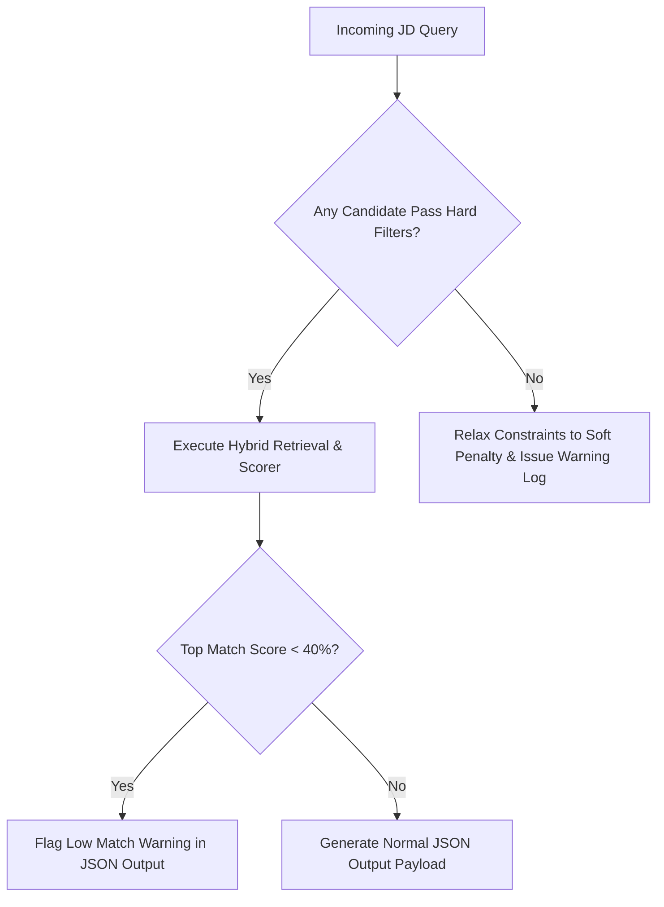

# Edge Cases & Defensive Strategies: Intelligent Resume-to-Job Matching Engine

## 1. Introduction

Real-world resumes and job descriptions present significant variations in formatting, quality, syntax, and layout. This document details known edge cases across document ingestion, metadata extraction, retrieval, and LLM reasoning, along with concrete handling strategies.

---

## 2. Ingestion & Document Parsing Edge Cases

| Edge Case Scenario | Problem Impact | Defensive Handling Strategy |
| :--- | :--- | :--- |
| **Scanned Image PDFs (No Text Layer)** | `pdfplumber` / `PyMuPDF` return empty string or garbled characters. | Implement automatic text fallback detection: If extracted string length $< 50$ characters, route through OCR engine (`tesseract` / `easyocr`). |
| **Multi-Column & Graphic Heavy Layouts** | Text extraction merges columns horizontally, mixing unrelated work experiences and skills. | Use layout-aware PDF parsers (`pdfplumber` bounding box analysis) to read blocks vertically before text aggregation. |
| **Unconventional Section Headings** | Non-standard headers (e.g. "My Journey", "Where I've Been", "Tech Stack") fail regex section chunking. | Implement fuzzy header matching and semantic embedding fallback to categorize unmapped headers into standard buckets (`Summary`, `Experience`, `Education`, `Skills`). |
| **Non-English / Multilingual Resumes** | Embeddings trained on English perform poorly on non-English resumes. | Detect document language (`langdetect`). Tag language in chunk metadata; reject or route non-English documents to multilingual models (`paraphrase-multilingual-MiniLM-L12-v2`). |
| **Corrupted or Password-Protected Files** | Pipeline crashes during batch ingestion. | Wrap file parser calls in `try...except` blocks. Log invalid files to `data/ingestion_errors.json` and flag for manual recruiter review. |

---

## 3. Metadata Extraction & Parsing Edge Cases

| Edge Case Scenario | Problem Impact | Defensive Handling Strategy |
| :--- | :--- | :--- |
| **Missing Candidate Name** | Header lacks explicit name tag, or resume starts directly with text body. | Inspect file basename (e.g. `jane_doe_resume.pdf`), first 3 lines of text, or fallback to `"Candidate <ID>"` placeholder. |
| **Ambiguous Date Formats & Overlapping Jobs** | Dates like `"05/20 - Present"`, `"2019 - 2021"`, or concurrent jobs result in inaccurate experience calculation. | Use `python-dateutil` with regex patterns for date range normalization. Merge overlapping date ranges to prevent double-counting total years. |
| **Non-Standard Skill Acronyms** | Skills like `"RAG"`, `"K8s"`, `"JS"`, `"Py"` mismatch exact search keywords. | Maintain a skill normalization dictionary (e.g. `K8s` $\rightarrow$ `Kubernetes`, `RAG` $\rightarrow$ `Retrieval-Augmented Generation`) prior to indexing and BM25 matching. |

---

## 4. Query & Job Description (JD) Edge Cases

| Edge Case Scenario | Problem Impact | Defensive Handling Strategy |
| :--- | :--- | :--- |
| **Vague / Ultra-Short Job Description** | Query vector lacks semantic specificity (e.g. `"Looking for a good developer"`). | Detect short queries ($< 20$ words). Prompt recruiter for missing details or expand query using LLM domain expansion. |
| **Unrealistic / Contradictory Constraints** | JD requests `"10 years experience in Rust"` (Rust reached stability in 2015). | Relax strict filtering constraints to soft scoring penalties when zero candidates satisfy hard filters. |
| **Internal Acronyms & Proprietary Tech** | JD mentions company-internal tooling (e.g. `"Project Nexus"`). | Filter out unrecognized company-internal jargon during query preprocessing to avoid polluting sparse BM25 vocabulary. |

---

## 5. Retrieval, Ranking & Explainability Edge Cases

| Edge Case Scenario | Problem Impact | Defensive Handling Strategy |
| :--- | :--- | :--- |
| **High Keyword Density / Buzzword Padding** | Candidate scores high on sparse BM25 despite lacking real depth. | Balance hybrid search weight ($\alpha = 0.7$ dense, $0.3$ sparse) so semantic context overrides isolated keyword repetition. |
| **Career Changers / Career Gaps** | Qualified candidates with recent transitions get penalized on total experience filters. | Evaluate section-specific experience years (e.g. relevant role years vs total career years) from metadata. |
| **Tie-Breaker Scenarios (Identical Scores)** | Multiple candidates receive identical match scores (e.g., score = 85). | Apply sub-rank sorting based on recency of experience and exact mandatory skill overlap count. |
| **LLM Reasoning Hallucination** | LLM invents candidate skills or achievements not found in the resume. | Inject strict grounding prompt rules requiring exact quotes from `relevant_excerpts` provided in prompt context. |

---

## 6. Verification & Test Suite for Edge Cases

To prevent regression, the `tests/` suite includes edge-case validation cases:
- `test_corrupted_pdf_handling()`
- `test_unconventional_headers()`
- `test_overlapping_experience_calculation()`
- `test_ultra_short_jd_query()`
- `test_llm_reasoning_grounding()`
