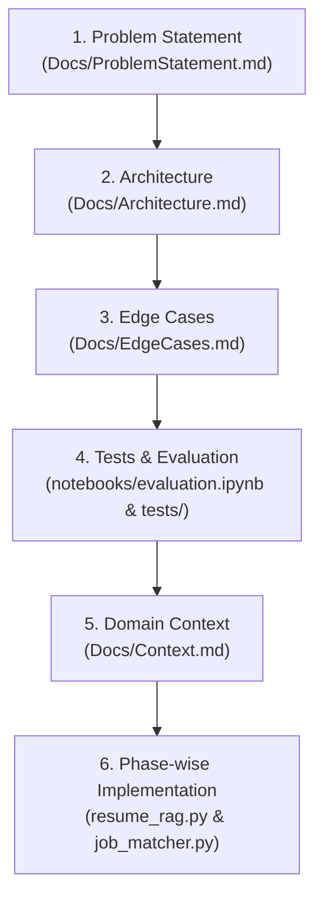

# Implementation Plan: Intelligent Resume-to-Job Matching Engine (RAG)

## 1. Project Goal & Master Engineering Workflow

### 1.1 Executive Summary & Project Goal
This implementation plan outlines the end-to-end development strategy for building a production-grade **Resume-to-Job Matching Engine** powered by Retrieval-Augmented Generation (RAG). The system is engineered to ingest unstructured resumes, perform section-aware chunking, extract structured metadata, and execute hybrid (dense + sparse) semantic retrieval to surface top-ranked candidates with explainable matching rationales.

The project is structured around **two core milestones**:
- **Milestone 1 (50%):** RAG System Setup (`resume_rag.py`) for document parsing, metadata extraction, and vector indexing.
- **Milestone 2 (50%):** Job Matching & Ranking Engine (`job_matcher.py`) for query vectorization, hybrid search, constraint filtering, and JSON output generation.

---

### 1.2 Master Project Workflow & Governance
The project follows a 6-stage engineering workflow connecting system specifications, technical design, edge-case mitigation, quantitative evaluation, domain context, and phase-wise execution:



#### Workflow Documentation Map
1. **[Problem Statement](file:///c:/LOCAL_DISK_%28D%29/Projects/RAG%20Based%20ProfileMatching/Docs/ProblemStatement.md):** Defines core ATS challenges, system inputs, JSON output schema, and milestone requirements.
2. **[Architecture](file:///c:/LOCAL_DISK_%28D%29/Projects/RAG%20Based%20ProfileMatching/Docs/Architecture.md):** Component design, sequence diagrams, vector metadata schemas, and technical stack choices.
3. **[Edge Cases](file:///c:/LOCAL_DISK_%28D%29/Projects/RAG%20Based%20ProfileMatching/Docs/EdgeCases.md):** OCR fallbacks, non-standard layout parsing, ambiguous dates, and defensive guards.
4. **[Tests / Evaluation](file:///c:/LOCAL_DISK_%28D%29/Projects/RAG%20Based%20ProfileMatching/notebooks/evaluation.ipynb):** Benchmarking latency, Hit Rate, MRR, Precision@K, and ablation study (Hybrid vs Semantic).
5. **[Context](file:///c:/LOCAL_DISK_%28D%29/Projects/RAG%20Based%20ProfileMatching/Docs/Context.md):** Recruitment domain knowledge, RAG adaptation rationale, and stakeholder touchpoints.
6. **[Phase-wise Implementation](file:///c:/LOCAL_DISK_%28D%29/Projects/RAG%20Based%20ProfileMatching/Docs/ImplementationPlan.md):** Actionable execution plan across 5 implementation phases.

---

## 2. Project Directory Structure

```
RAG Based ProfileMatching/
├── data/
│   ├── resumes/                  # Corpus of 30+ diverse resumes (.pdf, .docx, .txt)
│   └── job_descriptions/         # Corpus of 5+ technical job descriptions (.txt / .json)
├── Docs/
│   ├── ProblemStatement.md       # Problem definition & specifications
│   ├── Architecture.md           # System architecture & design specifications
│   └── ImplementationPlan.md     # Phase-by-phase execution roadmap
├── notebooks/
│   └── evaluation.ipynb          # Latency & accuracy benchmarking notebook
├── src/
│   ├── __init__.py
│   ├── chunker.py                # Section-aware resume chunker
│   ├── metadata_extractor.py     # Metadata entity parsing module
│   ├── retriever.py             # Dense vector + BM25 hybrid retriever
│   └── scorer.py                # 0-100 alignment scorer & reasoning prompt builder
├── resume_rag.py                 # Core RAG setup script (Milestone 1)
├── job_matcher.py                # Matching & ranking execution script (Milestone 2)
├── tests/                        # Unit tests for chunker, retriever, and schemas
├── requirements.txt              # Project dependencies
└── README.md                     # Documentation & setup guide
```

---

## 3. Phase-by-Phase Roadmap

### Phase 1: Environment & Dataset Initialization
* **Goal:** Establish developer environment and curate required dataset assets.
* **Tasks:**
  1. Initialize project structure and `requirements.txt` (`chromadb`, `sentence-transformers`, `rank-bm25`, `pydantic`, `pdfplumber`, `python-docx`).
  2. Assemble **30+ diverse resumes** in `data/resumes/` across various disciplines (Data Engineering, Frontend, Machine Learning, DevOps, Product Management) and formats (`.pdf`, `.docx`, `.txt`).
  3. Create **5+ comprehensive job descriptions** in `data/job_descriptions/` covering senior, mid, and entry-level engineering roles.

### Phase 2: RAG Pipeline Development (`resume_rag.py`) — Milestone 1 (50%)
* **Goal:** Build resume ingestion, section-aware chunking, metadata extraction, and vector indexing.
* **Tasks:**
  1. **Multi-Format Ingestion:** Implement `src/chunker.py` to parse text from `.pdf`, `.docx`, and `.txt` files.
  2. **Section Preservation:** Implement logical header detection (`Summary`, `Experience`, `Education`, `Skills`, `Projects`) to prevent arbitrary fixed-length splitting.
  3. **Metadata Extractor:** Implement `src/metadata_extractor.py` to automatically pull:
     * Candidate Name
     * Skill List
     * Years of Experience
     * Education Degree
  4. **Vector Store Indexing:** Embed chunks using `all-MiniLM-L6-v2` and populate ChromaDB collection with embedded vectors and associated JSON metadata.
  5. **CLI / Entrypoint:** Expose `resume_rag.py` to index the `data/resumes/` directory with a single execution.

### Phase 3: Job Matching & Ranking Engine (`job_matcher.py`) — Milestone 2 (50%)
* **Goal:** Execute query vectorization, hybrid retrieval, constraint filtering, 0-100 scoring, and reasoning generation.
* **Tasks:**
  1. **Job Description Vectorizer:** Ingest target JD and generate dense vector embeddings alongside sparse keyword lists.
  2. **Hybrid Retriever (`src/retriever.py`):** Combine ChromaDB dense cosine similarity with `rank_bm25` sparse keyword similarity. Apply weighted fusion to rank top-$K$ ($K = 10$) candidates.
  3. **Constraint Filter & Scorer (`src/scorer.py`):**
     * Apply pre/post-retrieval filters for hard requirements (e.g. minimum years of experience).
     * Normalize similarity scores onto a `0–100` alignment scale.
  4. **Explainable AI Generator:** Integrate LLM prompt template to produce natural language justifications citing exact matched skills and relevant resume excerpts.
  5. **JSON Formatter:** Format output into the strict schema specified in `ProblemStatement.md` section 4.2.

### Phase 4: Evaluation, Benchmarking & Experimentation (`notebooks/evaluation.ipynb`)
* **Goal:** Quantify system performance and demonstrate hybrid search superiority.
* **Tasks:**
  1. **Latency Benchmarks:** Measure chunking speed, embedding creation latency, and top-$K$ retrieval response times.
  2. **Accuracy Assessment:** Evaluate retrieval performance across test JDs using **Hit Rate**, **Mean Reciprocal Rank (MRR)**, and **Precision@K**.
  3. **Ablation Study:** Compare Dense-Only retrieval vs. Sparse-Only (BM25) retrieval vs. Hybrid Retrieval.

### Phase 5: Verification, Documentation & Submission Packaging
* **Goal:** Package deliverables for submission and verify end-to-end functionality.
* **Tasks:**
  1. Run end-to-end tests verifying `resume_rag.py` ingestion and `job_matcher.py` execution against all 5 JDs.
  2. Validate JSON output against Pydantic schema models.
  3. Update `README.md` with installation commands, usage examples, and architecture summary.
  4. Record a 3–4 minute walkthrough video demonstrating ingestion, matching query, and structured JSON output.

---

## 4. Work Breakdown Structure & Deliverables Matrix

| Phase | Core Deliverable | Output Files | Priority |
| :--- | :--- | :--- | :--- |
| **Phase 1** | Dataset & Dependencies | `data/resumes/`, `data/job_descriptions/`, `requirements.txt` | High |
| **Phase 2** | RAG Setup Script | `resume_rag.py`, `src/chunker.py`, `src/metadata_extractor.py` | Critical (50%) |
| **Phase 3** | Job Matcher Engine | `job_matcher.py`, `src/retriever.py`, `src/scorer.py` | Critical (50%) |
| **Phase 4** | Benchmark Notebook | `notebooks/evaluation.ipynb` | Mandatory |
| **Phase 5** | Documentation & Video | `README.md`, Demo Video Link | Submission |

---

## 5. Verification & Testing Strategy

To ensure code quality and project completion:

1. **Unit Verification:**
   * Validate section chunking accuracy across sample multi-page PDFs.
   * Verify metadata extraction correctness (name, experience years, skills).
2. **Integration Verification:**
   * Execute `python resume_rag.py --data_dir data/resumes` to confirm zero indexing errors.
   * Execute `python job_matcher.py --jd_path data/job_descriptions/jd1.txt` to confirm valid JSON generation.
3. **JSON Schema Validation:**
   * Run automated tests validating output keys (`job_description`, `candidate_name`, `match_score`, `matched_skills`, `relevant_excerpts`, `reasoning`).

---

## 6. Risk Management & Risk Mitigation

| Risk | Potential Impact | Mitigation Strategy |
| :--- | :--- | :--- |
| **Unstructured Resume Layouts** | Parsing errors or missing sections | Fallback to sentence/paragraph splitting if headers are not detected. |
| **Keyword Density Overshadowing Context** | False positives in BM25 search | Tune hybrid fusion parameter $\alpha$ (e.g. $0.7$ dense / $0.3$ sparse). |
| **LLM Reasoning Latency / Cost** | Slow output payload generation | Batch explainability generation and restrict prompt context to top candidate excerpts. |
| **Missing Candidate Metadata** | Failed experience or skill filtering | Implement regex and fallback heuristic parsing when LLM metadata extraction is partial. |
