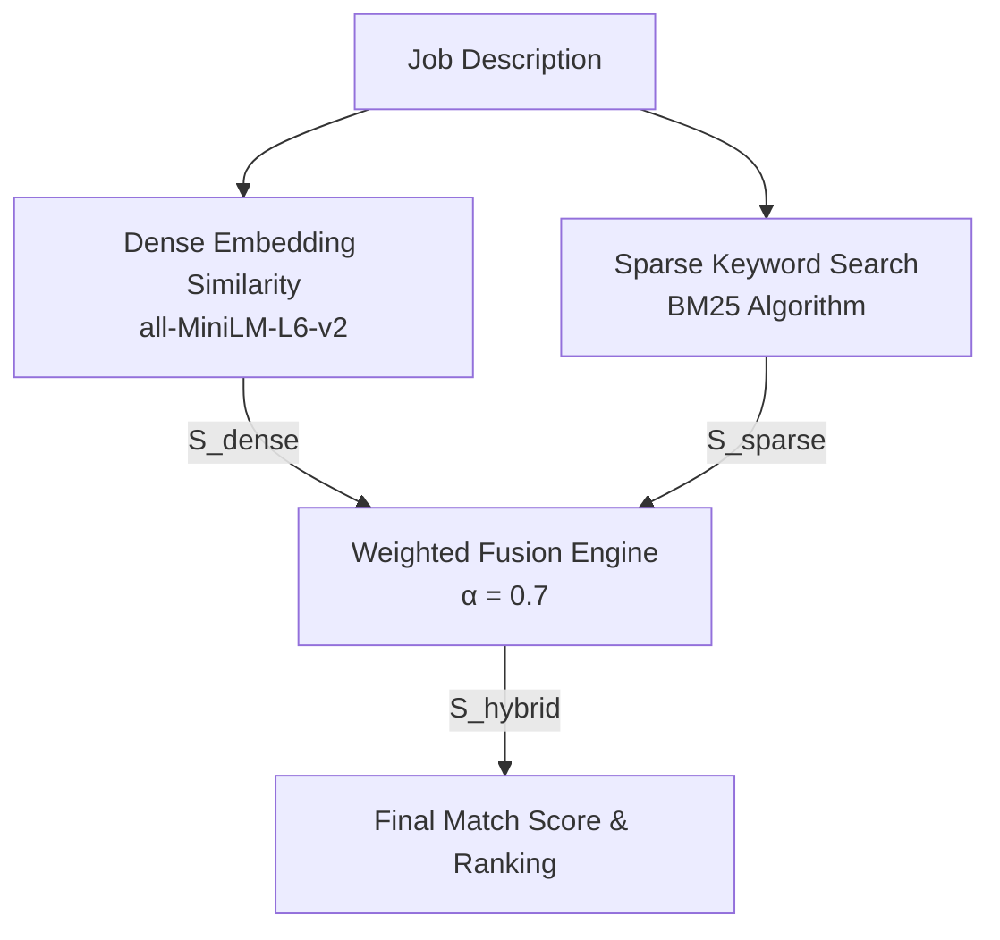
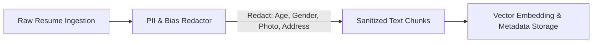

# Special Strategies: Advanced RAG Optimization & Matching Techniques

## 1. Overview & Strategy Objectives

This document details advanced algorithmic and architectural strategies designed to maximize precision, recall, and fairness in the **Resume-to-Job Matching Engine**.

---

## 2. Dynamic Hybrid Search Fusion (Dense + Sparse)

Standard vector retrieval often struggles with exact skill syntax (e.g. distinguishing `"Python 2"` vs `"Python 3"` or `"AWS S3"` vs `"AWS EC2"`), whereas sparse keyword matching (BM25) fails to recognize semantic equivalences. We implement a **Dynamic Weighted Score Fusion Strategy**:

$$\mathbf{S}_{\text{hybrid}} = \alpha \cdot \mathbf{S}_{\text{dense}} + (1 - \alpha) \cdot \mathbf{S}_{\text{sparse}}$$



### Dynamic Alpha ($\alpha$) Adjustment Strategy
* **Conceptual / Senior JDs:** Increase $\alpha = 0.8$ (prioritize high-level architecture & domain concepts).
* **Tool-Specific / Technical JDs:** Decrease $\alpha = 0.5$ (give equal weight to exact tool and framework matches).

---

## 3. Section-Aware Importance Multipliers

Not all resume sections carry equal weight when matching against a Job Description. A skill mentioned under `Work Experience` demonstrates practical application, whereas the same skill under `Interests` carries less hiring signal.

We apply **Section Weight Multipliers ($\mathbf{W}_{\text{section}}$)** during chunk scoring:

| Resume Section | Importance Multiplier ($\mathbf{W}_{\text{section}}$) | Rationale |
| :--- | :--- | :--- |
| **Work Experience** | $1.5\times$ | High signal: Direct real-world application & achievement. |
| **Projects & Portfolio** | $1.2\times$ | Medium-High signal: Hands-on implementation & code assets. |
| **Skills & Summary** | $1.0\times$ | Standard signal: Baseline declaration of competence. |
| **Certifications** | $1.1\times$ | Verified signal: Accredited domain validation. |
| **Education** | $0.8\times$ | Foundational signal: Academic baseline. |

$$\mathbf{S}_{\text{adjusted}} = \mathbf{S}_{\text{hybrid}} \times \mathbf{W}_{\text{section}}$$

---

## 4. Anti-Bias & PII Redaction Strategy

To promote fair hiring practices and comply with employment regulations (e.g. EEOC guidelines), the pipeline incorporates a **Pre-Indexing Bias Reduction Strategy**:



### Redaction Targets
1. **Demographic Identifiers:** Age, date of birth, gender pronouns, marital status.
2. **Personal Contact Information:** Street address, personal photos, social security / ID numbers (retaining email/LinkedIn for recruiter contact).
3. **Institutional Prestige Masking (Optional):** Normalizing university names to degree types (`"B.S. in Computer Science"`) to prevent institutional bias during initial automated screening.

---

## 5. Explainable AI (XAI) Prompt Engineering Strategy

To ensure matching explanations are grounded, factual, and actionable, the LLM reasoning generator uses a **Strict Grounded Prompt Contract**:

### Prompt Engineering Template
```text
SYSTEM PROMPT:
You are an expert technical recruiter analyzing candidate fit for a job description.
You MUST base your reasoning SOLELY on the provided RESUME EXCERPTS. 
Do NOT assume or hallucinate skills, tools, or years of experience not explicitly supported by the excerpts.

INPUT CONTEXT:
Job Description: {job_description}
Candidate Name: {candidate_name}
Matched Skills: {matched_skills}
Relevant Excerpts:
{relevant_excerpts}

OUTPUT FORMAT:
Generate a concise, 2-sentence rationale formatted as follows:
"Strong/Moderate/Weak match: [Cite specific experience years & key skills from excerpts]. [State direct production experience or project alignment]."
```

---

## 6. Cold-Start & Low-Data Fallback Strategies

When initializing the system with a sparse vector database ($< 10$ resumes) or processing an obscure niche role:

1. **Synthetic Query Expansion:** Expand niche JD keywords using domain synonyms (e.g., expanding `"Golang"` $\rightarrow$ `"Go", "goroutines", "gin-gonic"`).
2. **Soft Constraint Relaxation:** Convert hard filtering thresholds into penalty deductions (e.g., if no candidate has 5+ years experience, penalize candidates with 3 years by $-10$ points rather than filtering them out completely).
3. **Candidate Skill Gap Analysis:** For candidates scoring $60–79\%$, generate actionable feedback highlighting exact missing skills required to reach an $85\%+$ score.
